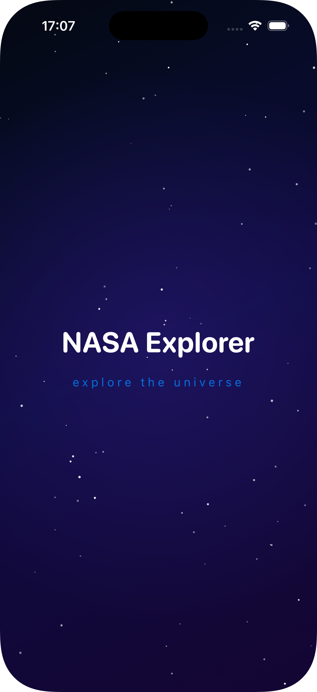
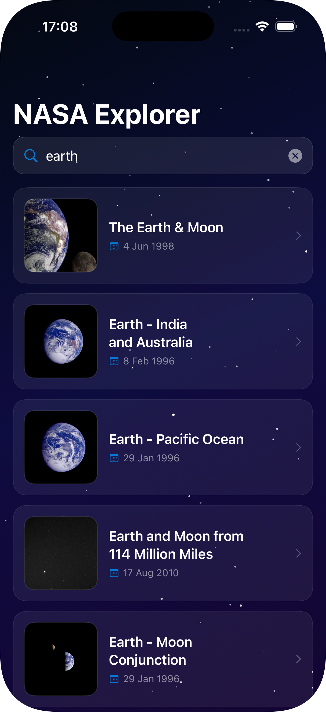
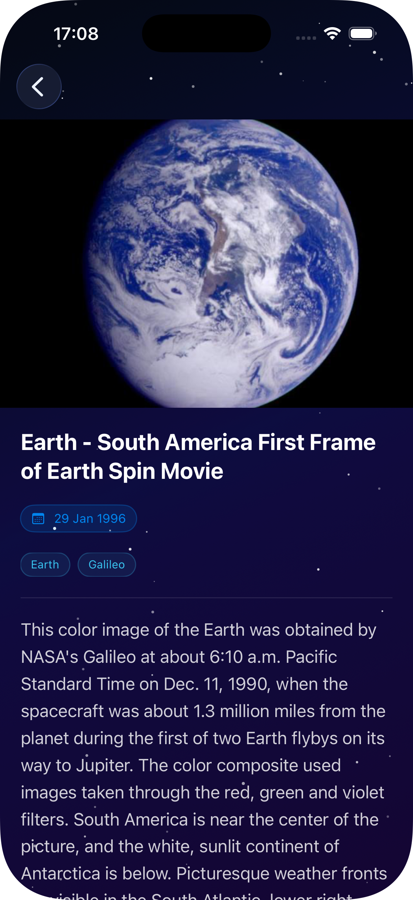

# NASA Explorer 🚀

App iOS que te permite explorar el archivo de imágenes de la NASA a través de una interfaz limpia con temática espacial. Buscá galaxias, nebulosas, planetas y mucho más usando la API pública de la NASA.

---

## Capturas de pantalla

| Splash | Búsqueda | Detalle |
|--------|----------|---------|
|  |  |  |

---

## API

Esta app utiliza la [NASA Image and Video Library API](https://images.nasa.gov).

| Endpoint | Descripción |
|----------|-------------|
| `GET https://images-api.nasa.gov/search?q={query}&media_type=image` | Búsqueda de imágenes por palabra clave |

No requiere API key.

---

## Arquitectura

El proyecto sigue **Clean Architecture** con tres capas explícitas:

```
NASAExplorer/
├── Data/
│   ├── Network/        # APIClient (URLSession + async/await), Endpoints
│   ├── DTOs/           # Modelos Decodable + Mapper (DTO → Entidad)
│   ├── Cache/          # QueryCache (en memoria, TTL configurable)
│   └── Repositories/   # APODRepositoryImpl
├── Domain/
│   ├── Entities/       # APODItem (Swift puro, sin imports de frameworks)
│   ├── Repositories/   # Protocolo APODRepository
│   └── UseCases/       # SearchAPODUseCase
└── Presentation/
    ├── Search/         # SearchViewModel + SearchView
    ├── Detail/         # DetailView
    └── Components/     # APODCardView, SplashView, StarsView
```

### Decisiones técnicas

**Separación Data / Domain / Presentation**
Domain no conoce nada de red ni de UI. Data implementa el protocolo de repositorio definido en Domain. Presentation solo interactúa con Domain a través de UseCases.

**Inyección de dependencias por inicializador**
Todas las dependencias (HTTPClient, QueryCache, Repository) se inyectan por `init`, haciendo cada capa testeable de forma independiente sin frameworks de mocking.

**Estrategia de caché**
`QueryCache` es un `actor` de Swift con caché en memoria y TTL configurable (5 minutos por defecto). En cada búsqueda:
1. Se verifica el caché por clave normalizada (minúsculas, sin espacios)
2. Cache hit → retorna inmediatamente, sin llamada a red
3. Cache miss → obtiene datos de la API, almacena el resultado y retorna

**Cancelación de búsqueda**
Cada búsqueda crea un nuevo `Task` almacenado en `searchTask`. Al iniciar una nueva búsqueda, la tarea anterior se cancela antes de lanzar la nueva. El `CancellationError` se captura silenciosamente — es comportamiento esperado, no un error.

**Paginación**
No implementada ya que está fuera del alcance de este challenge. La implementación actual obtiene 20 resultados por búsqueda, suficiente para demostrar la funcionalidad requerida. Podría añadirse como mejora futura usando el parámetro `page` de la API.

---

## Stack tecnológico

| | |
|---|---|
| Lenguaje | Swift 5.9 |
| UI | SwiftUI |
| Concurrencia | async/await, Swift actors |
| Networking | URLSession |
| Arquitectura | Clean Architecture (Data / Domain / Presentation) |
| Testing | XCTest |
| iOS mínimo | 16.0 |

---

## Cómo ejecutar

1. Cloná el repositorio:
```bash
git clone https://github.com/jcreyesDev/NASAExplorer.git
```

2. Abrí en Xcode:
```bash
cd NASAExplorer
open NASAExplorer.xcodeproj
```

3. Seleccioná un simulador (iOS 16+) y presioná **⌘R**

No se requiere configuración adicional. La NASA Image Library API no requiere API key.

---

## Ejecutar tests

Presioná **⌘U** en Xcode.

### Cobertura de tests

| Capa | Archivo | Tests | Qué cubre |
|------|---------|-------|-----------|
| Data | `QueryCacheTests` | 4 | Cache hit, miss, expiración TTL, sobreescritura |
| Domain | `SearchUseCaseTests` | 4 | Éxito, resultados vacíos, propagación de errores, reenvío de query |

---

## Autor

Desarrollado por [@jcreyesDev](https://github.com/jcreyesDev)
